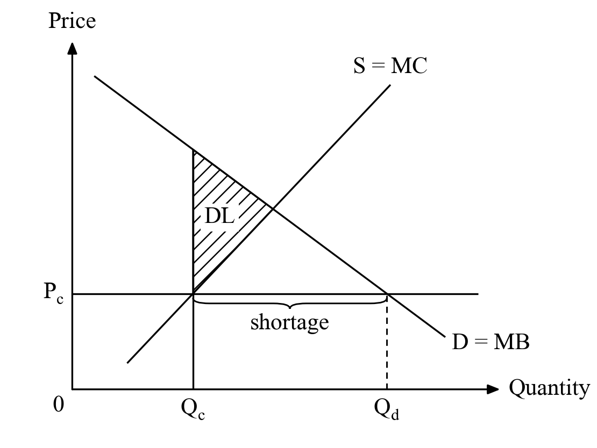
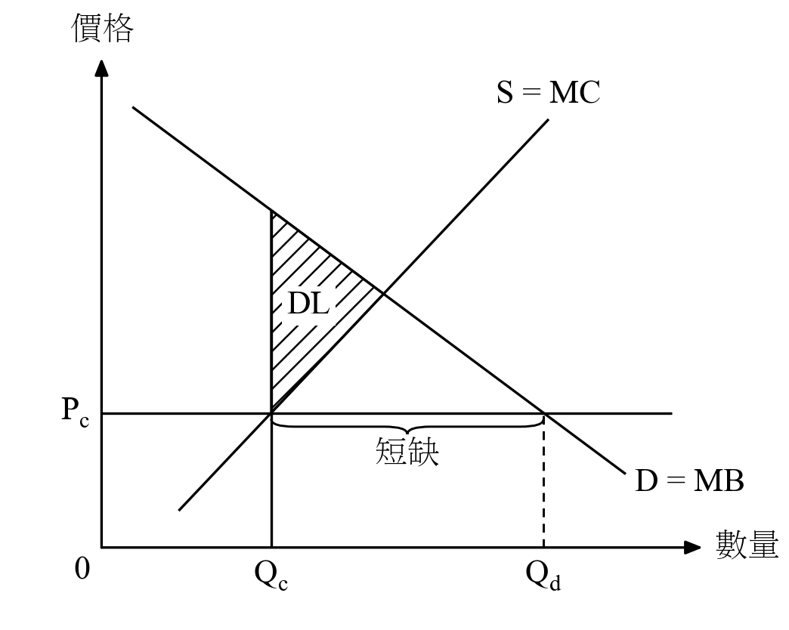
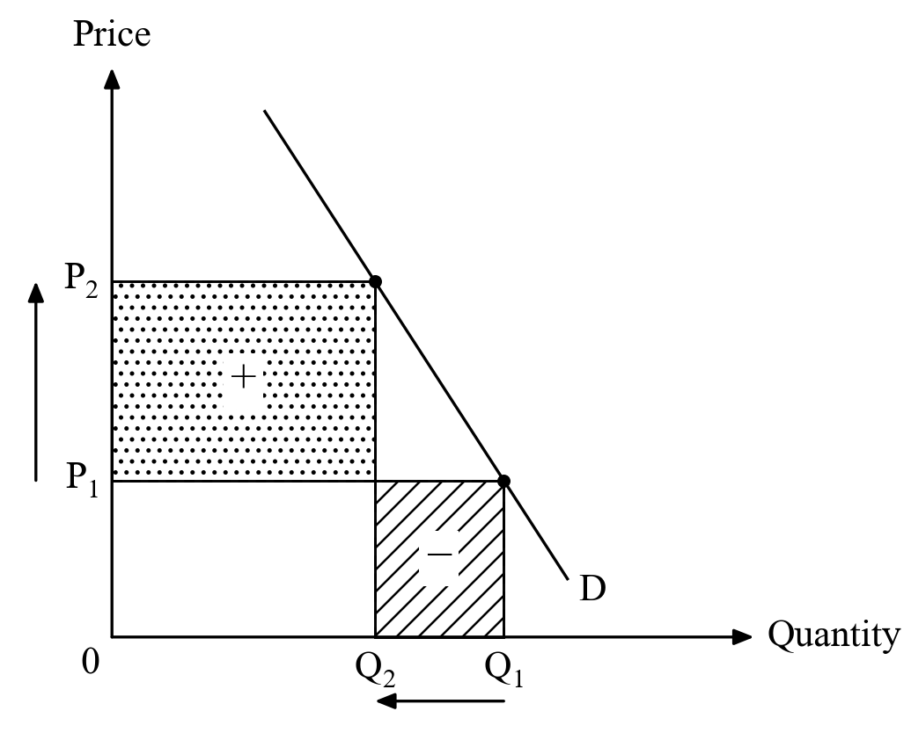
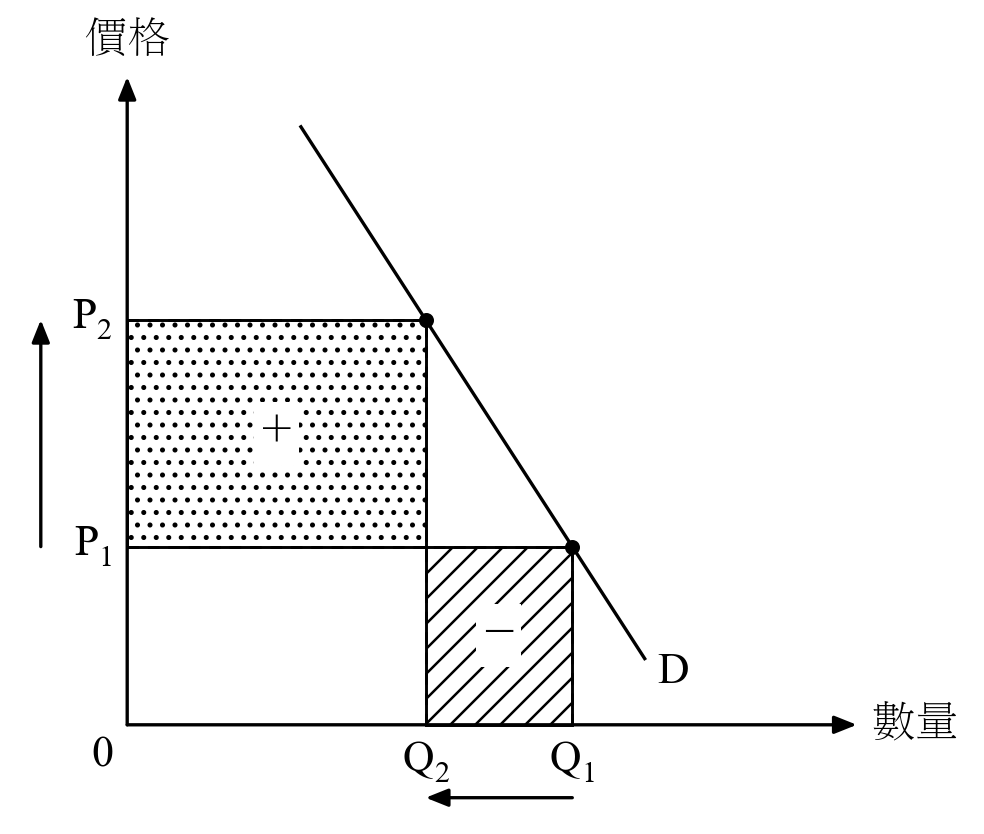
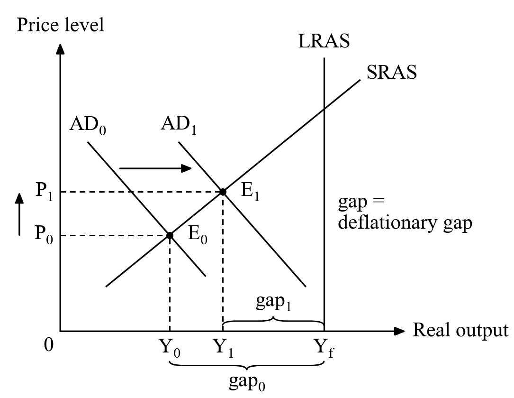
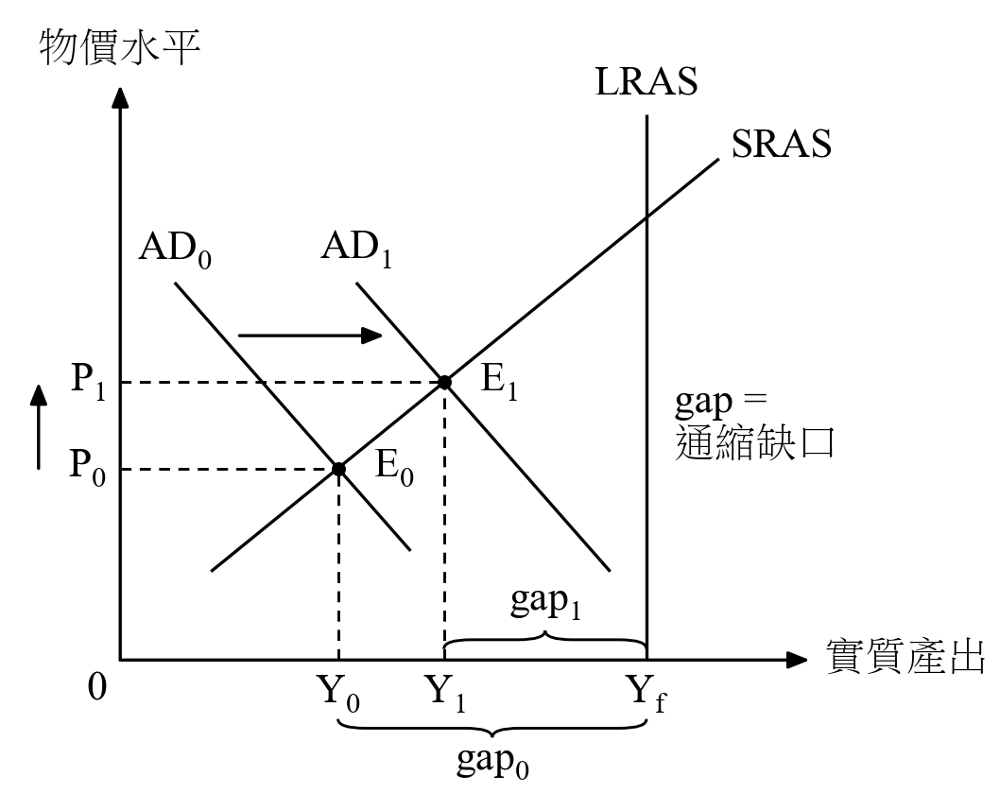

# DSE Economics diagrams · DSE 經濟圖

**Paste a DSE Economics question and its marking scheme into an AI chat, and
get the diagram back, drawn like the HKEAA marking schemes.** English or
Traditional Chinese, black and white, ready for your worksheet. No coding.

**把 DSE 經濟題目和評卷參考貼到 AI 對話，就會得到 HKEAA 評卷參考風格的圖。**
中英文皆可，黑白印刷，直接放進工作紙，不用識寫程式。

| English | 中文 |
|---|---|
|  |  |
|  |  |
|  |  |

It knows every supply-and-demand and AD-AS diagram in the marking schemes
(43 types). See them all in [`gallery/`](gallery/).

---

## For teachers

### 1. Download one file

**[⬇ dse-econ-graph.zip](https://github.com/dinomartino/dse-econ-graph/releases/latest/download/dse-econ-graph.zip)**

Don't unzip it. It already holds everything the AI needs.

### 2. Set it up once in your AI

Pick one. **Grok is recommended:** it works in Hong Kong without a VPN.
Claude and ChatGPT are not available in Hong Kong, so you need a VPN for them.

**Grok (recommended)** — [grok.com](https://grok.com)
1. Open **Projects** ▸ create a new project, e.g. "DSE Economics Diagrams".
2. Copy the **instructions text** (below) into the project's **Instructions**.
3. Upload `dse-econ-graph.zip` to the project's files.

**Claude (needs a VPN in Hong Kong)** — [claude.ai](https://claude.ai), web or app
1. Open **Settings ▸ Capabilities** and turn on **Code execution and file creation**.
2. Under **Skills**, click **Upload skill** and choose `dse-econ-graph.zip`.
3. That's all. No instructions text is needed: every new chat can draw.

**ChatGPT (needs a VPN in Hong Kong)** — [chatgpt.com](https://chatgpt.com)
1. In the sidebar, click **New project**, e.g. "DSE Economics Diagrams".
2. In the project's settings, paste the **instructions text** (below) into **Instructions**.
3. Upload `dse-econ-graph.zip` to the project's files.

<details>
<summary><b>Instructions text</b> (for Grok and ChatGPT; also inside the zip as <code>instructions.txt</code>)</summary>

<!-- BEGIN INSTRUCTIONS -->

```text
You draw HKDSE Economics diagrams in the black-and-white HKEAA marking-scheme style. Your guide is SKILL.md (dse-econ-graph). It is inside dse-econ-graph.zip in this project's files: unzip it with your code tool and read SKILL.md in full before your first diagram. Always follow it exactly.

The teacher only pastes a question and its marking scheme. That always means: draw the diagram(s) for it and reply with the picture(s) ONLY.

1. Never ask questions. Decide the diagram yourself from the question and the marking scheme. Every "indicate / illustrate in the diagram" point must be visible and labelled.
2. Language = the language of the pasted question (Chinese -> 中文 labels, English -> English). Both only if asked.
3. One picture per part that needs a diagram ((b)(i), (b)(ii) ...).
4. Write ONE Python script: first the library (from the unzipped folder: import sys; sys.path.insert(0, "dse-econ-graph"); from dsegraph import *), then the diagram, starting from the matching template in SKILL.md. Do not pip install or download anything.
5. Run it with your code tool. Check the picture against the guide's checklist; fix and run again silently.
6. Reply with the picture(s) only: no code, no explanation, no questions. With several pictures, only the part label above each.
7. If the output says "NO CHINESE FONT", or the picture does not appear, or you cannot run code: follow the guide (one short line + the script as one code block for colab.new).
8. If the teacher asks for a change in words, redraw and reply with the new picture only.
```

<!-- END INSTRUCTIONS -->
</details>

### 3. Every time: paste, and get the picture

Open your project (in Claude, any chat) and **just paste the question and
its marking scheme**. Nothing else is needed.

- The AI replies with **only the finished picture**: no code, no questions.
- A Chinese question gets a 中文 diagram; an English question gets an English one.
- Several parts get one picture each.
- Right-click the picture ▸ *Save image as…* and put it in your worksheet.
- Not quite right? Say so in words, e.g. *"make demand steeper"*,
  *"move 'shortage' lower"* or *"English too"*, and it draws it again.

If the AI ever gives you code instead of a picture: open
[colab.new](https://colab.new), paste the code, and press ▶. The picture
appears and downloads.

**New version?** Download the zip again and replace the old one: in your
Grok or ChatGPT project's files, or in Claude's Settings ▸ Capabilities ▸ Skills.

---

## 老師使用說明

### 1. 下載一個檔案

**[⬇ dse-econ-graph.zip](https://github.com/dinomartino/dse-econ-graph/releases/latest/download/dse-econ-graph.zip)**

不用解壓，所需的一切都已在裏面。

### 2. 在 AI 設定一次

三選一。**建議使用 Grok**：香港可直接使用，不用 VPN。Claude 和 ChatGPT 在香港需使用 VPN。

**Grok（建議）** — [grok.com](https://grok.com)
1. 打開 **Projects（專案）** ▸ 建立新專案，例如「DSE 經濟圖」。
2. 把上面的**指示文字**（Instructions text）複製到專案的 **Instructions（指示）**。
3. 把 `dse-econ-graph.zip` 上載到專案的檔案。

**Claude（在香港需使用 VPN）** — [claude.ai](https://claude.ai)，網頁版或 App 皆可
1. 打開 **Settings ▸ Capabilities**，開啟 **Code execution and file creation**。
2. 在 **Skills** 下按 **Upload skill**，選擇 `dse-econ-graph.zip`。
3. 完成。不用指示文字，之後每個新對話都能畫圖。

**ChatGPT（在香港需使用 VPN）** — [chatgpt.com](https://chatgpt.com)
1. 在側邊欄按 **New project（新專案）**，例如「DSE 經濟圖」。
2. 在專案設定中，把**指示文字**貼到 **Instructions（指示）**。
3. 把 `dse-econ-graph.zip` 上載到專案的檔案。

### 3. 每次使用：貼上，就有圖

打開專案（Claude 則任何對話皆可），**只需貼上題目和評卷參考**。

- AI 只會回覆畫好的圖，不會給程式碼或反問。
- 中文題目畫中文圖，英文題目畫英文圖；每分題一張。
- 在圖片上按右鍵 ▸「另存圖片」，即可放進工作紙。
- 要修改？直接用文字說，例如「需求曲線畫斜一點」、「把『短缺』移低一點」或「也要英文版」，它會重畫。

如果 AI 給你程式碼而不是圖片：打開 [colab.new](https://colab.new)，貼上程式碼，按 ▶，圖片會顯示並自動下載。

**有新版本？** 重新下載 zip，取代舊的：Grok 或 ChatGPT 在專案檔案中替換，Claude 在 Settings ▸ Capabilities ▸ Skills 替換。

---

## What it can draw

Every supply-and-demand and AD-AS diagram type found in the HKDSE / HKCEE
marking schemes, each tested in English and Chinese:

- **Demand and supply:** shifts, simultaneous shifts ("under what condition"), vertical supply.
- **Labour market:** minimum wage, imported workers.
- **Total revenue and elasticity:** gain and loss areas, change in TR only.
- **Price fixed away from equilibrium:** shortage, surplus, rent and fees.
- **Price controls and deadweight loss.**
- **Tax, subsidy and quota.**
- **Consumer and producer surplus.**
- **AD-AS:** demand and supply shocks, LRAS and growth, deflationary and
  inflationary gaps, self-adjustment.

The full list, with the past-paper questions each template matches, is in
[`SKILL.md`](SKILL.md) under "Templates".

---

## For developers

| Where | How |
|---|---|
| **Claude Code** | `git clone https://github.com/dinomartino/dse-econ-graph ~/.claude/skills/dse-econ-graph` |
| **A website** | read [`download/manifest.json`](download/): see [`download/README.md`](download/README.md) |
| **Your own Python** | `pip install matplotlib pillow`, put `dsegraph.py` beside your script |

```python
from dsegraph import *

setup("zh")                                   # or "en"
fig, ax = new(3.2, 2.6)                       # printed size in inches
O = (12, 12)
axes(ax, O, (88, 12), (12, 90), T("Quantity", "數量"), T("Price", "價格"))
D = Line((20, 82), (78, 22)); S = Line((20, 22), (78, 82))
draw(ax, D, 20, 78, "D"); draw(ax, S, 20, 78, "S")
P = 34
line(ax, (O[0], P), (84, P)); label(ax, 10.5, P, "P", ha="right")
brace(ax, S.x(P), D.x(P), P - 1, T("shortage", "短缺"))
save(fig, "shortage.png")
```

Every point comes from exact geometry (`meet(D, S)`, `D.x(P)`,
`S.shift(dx=10)`, `S.shift(dy=tax)`), so curves always meet where the
labels say. Templates are in [`examples/`](examples/).

**Fonts.** English uses Times New Roman, or the Times-like STIX font that
ships with matplotlib. Chinese uses the first serif it finds: PMingLiU /
MingLiU (Windows), Songti TC (macOS) or Noto Serif CJK TC (Linux). Failing
that, it uses an uploaded font file, then any installed font that has
Chinese, and as a last resort downloads the free Noto Serif TC once.

**Building.** Add a template as `examples/NN_name.py` (copy an existing
one), then run `python tools/build.py`. It renders the gallery, pastes the
library and every template into `SKILL.md`, runs each template as a chat
AI would paste it, and rewrites `download/`. Project notes and the release
steps are in [`CLAUDE.md`](CLAUDE.md).

## Notes

- The style imitates the diagrams in HKEAA marking schemes; this project is
  not affiliated with or endorsed by the HKEAA.
- Chinese terms follow the EDB *English-Chinese Glossary of Terms Commonly
  Used in the Teaching of Economics in Secondary Schools* (2020).
- MIT licence.
