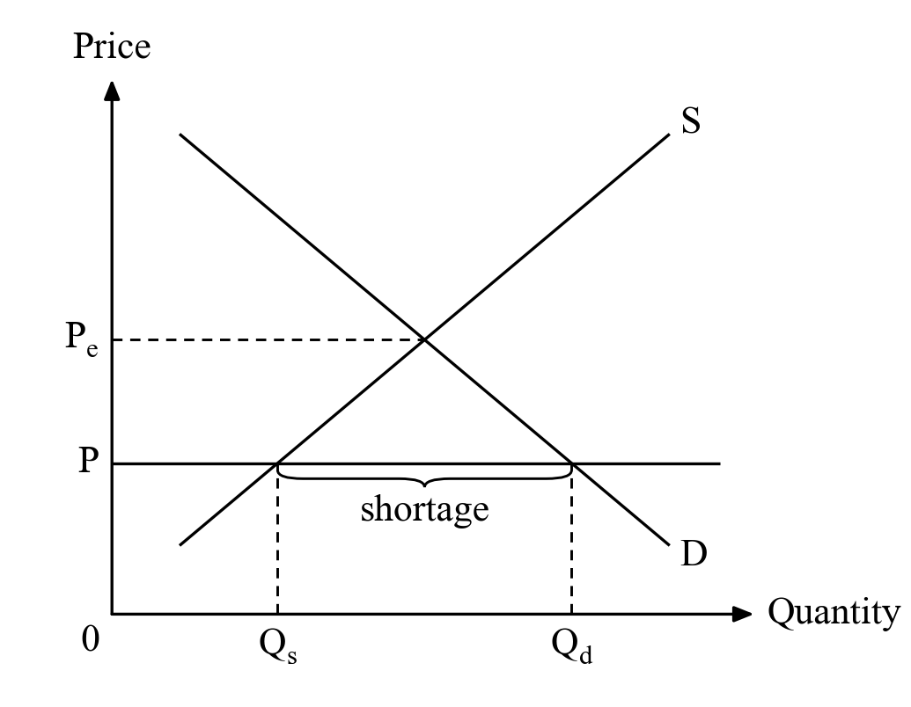
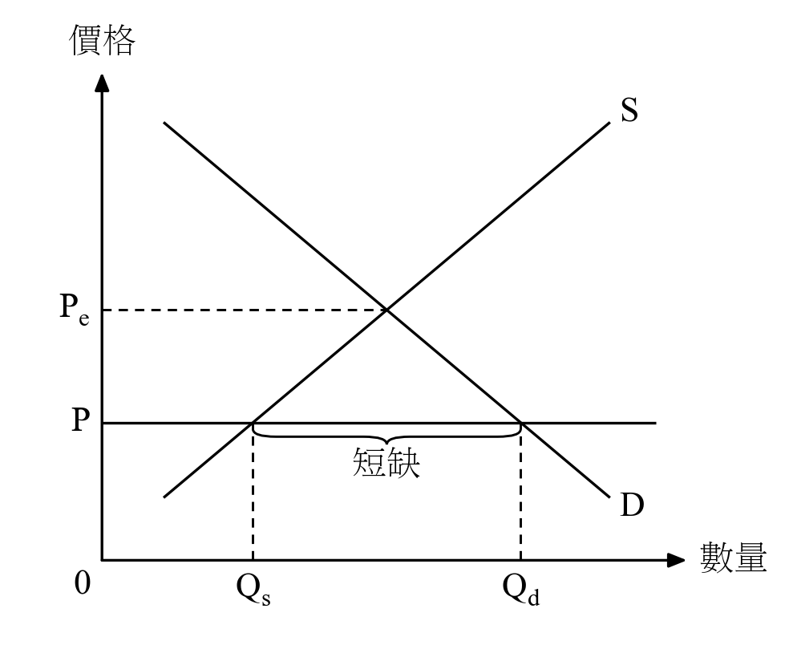
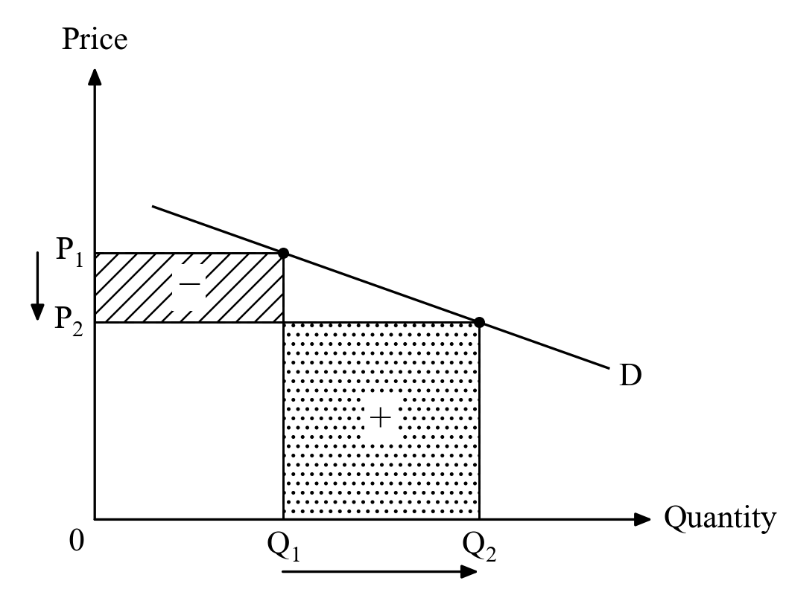
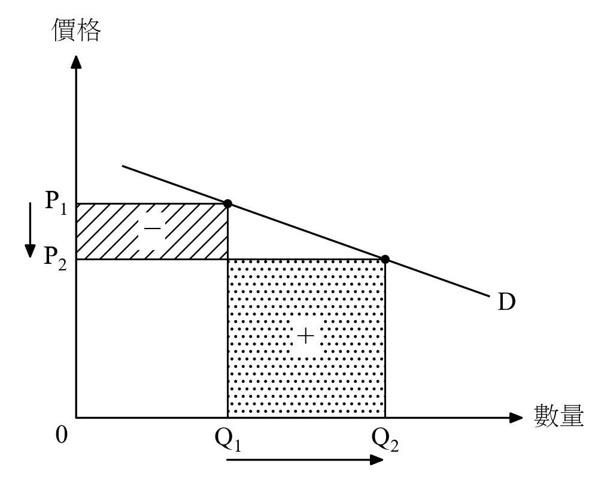
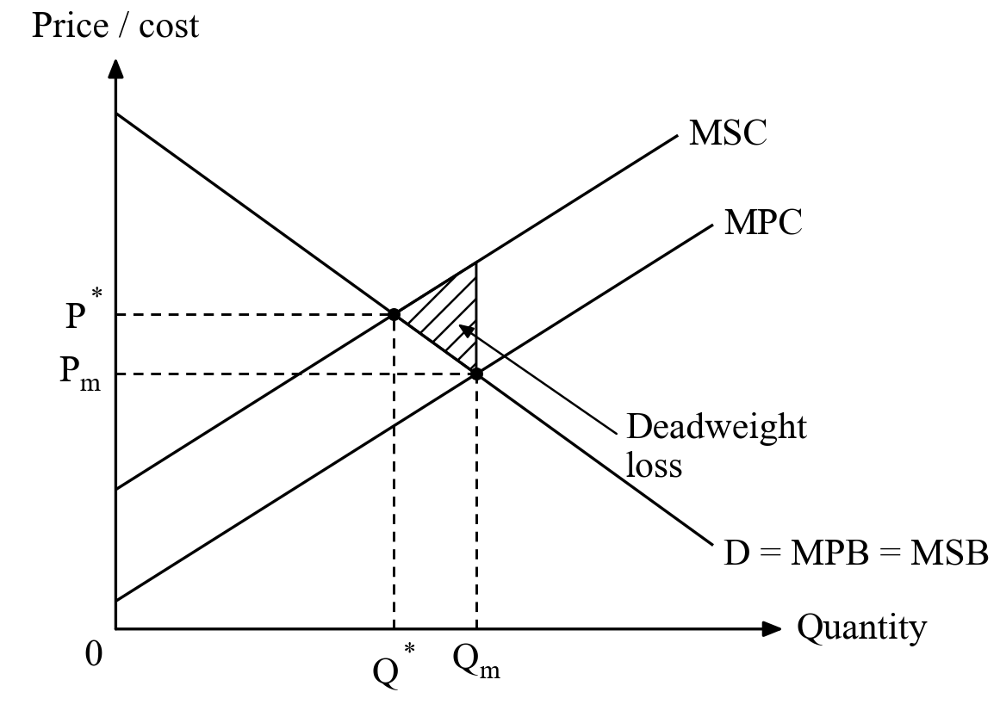
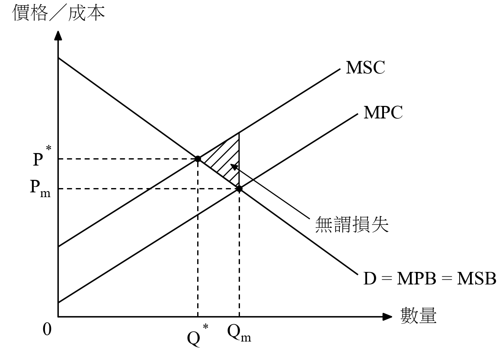

# dse-econ-graph

**Draw HKDSE Economics diagrams in code — in the black-and-white HKEAA
marking-scheme style, in English and Traditional Chinese.**

An AI skill plus a tiny Python library. Give it to any AI assistant
(Claude, ChatGPT, Gemini, …), describe a question or paste a marking scheme,
and you get back one Python script that draws the diagram exactly like the
official papers: Times-style serif (Chinese: Ming/Song serif), thin lines,
arrow axes, dashed guides, `////` hatching, curly braces. No colour, no
blurry scans, no AI-art look. Copy it, run it, paste the PNG into your notes.

| English | 中文 |
|---|---|
|  |  |
|  |  |
|  |  |

More in [`gallery/`](gallery/).

## Use it with an AI assistant

The whole skill is one file: **[`SKILL.md`](SKILL.md)** — the rules, the
economics checklist, the English/Chinese term table and the full library.

| Where | How |
|---|---|
| **Claude Code** | `git clone https://github.com/dinomartino/dse-econ-graph ~/.claude/skills/dse-econ-graph` — then just ask "draw the shortage diagram for …" |
| **Claude.ai** (Settings → Capabilities → Skills) | upload `dse-econ-graph.zip` from the [latest release](../../releases/latest) |
| **ChatGPT / Gemini / any web chat** | upload `SKILL.md` as a file (or paste it), then ask. For repeated use put it in a Custom GPT / Gem / Project as knowledge. |

Then ask in plain words, e.g.

> Draw the diagram for this marking scheme in English and Chinese:
> "Indicate in the diagram: price below equilibrium (1), rightward shift of
> demand (1), shortage increases from a to b (1)."

The assistant answers with a single script. Run it:

- **Google Colab** — paste into a cell and run. For Chinese labels, first
  run `!apt-get -qq install fonts-noto-cjk` and restart the runtime.
- **Your computer** — `pip install matplotlib pillow`, save as
  `diagram.py`, run `python diagram.py`.

It writes `diagram_en.png` / `diagram_zh.png` at 300 dpi (`.svg` on request).

## Use the library directly

```python
from dsegraph import *

setup("zh")                                   # or "en"
fig, ax = new(3.2, 2.6)                       # printed size in inches
O = (12, 12)
axes(ax, O, (88, 12), (12, 90), T("Quantity", "數量"), T("Price", "價格"))
D = Line((20, 82), (78, 22)); S = Line((20, 22), (78, 82))
draw(ax, D, 20, 78, "D"); draw(ax, S, 20, 78, "S")
P = 34
line(ax, (O[0], P), (84, P)); label(ax, 10.5, P, "P", ha="right")
brace(ax, S.x(P), D.x(P), P - 1, T("shortage", "短缺"))
save(fig, "shortage.png")
```

Every point comes from exact geometry (`meet(D, S)`, `D.x(P)`,
`S.shift(dx=10)`, `S.shift(dy=tax)`), so curves always meet where the
labels say. See the [templates](examples/) for price floors, shifting
demand at a fixed price, total revenue and elasticity, unit tax incidence,
consumer / producer surplus and deadweight loss, externalities and the PPC.

## Fonts

English uses Times New Roman, or the Times-like STIX font that ships with
matplotlib. Chinese uses the first serif it finds: PMingLiU / MingLiU
(Windows), Songti TC (macOS), Noto Serif CJK TC (Linux, Colab after
`apt-get install fonts-noto-cjk`).

## Contributing

Add a template as `examples/NN_name.py` (copy an existing one: a
`diagram(lang)` function that makes both languages), then run

```bash
python tools/build.py
```

which re-renders the gallery, pastes the current library and template list
into `SKILL.md`, and packs `dist/dse-econ-graph.zip`.

## Notes

- The style imitates the diagrams in HKEAA marking schemes; this project is
  not affiliated with or endorsed by the HKEAA.
- Chinese terms follow the EDB *English-Chinese Glossary of Terms Commonly
  Used in the Teaching of Economics in Secondary Schools* (2020).
- MIT licence.
